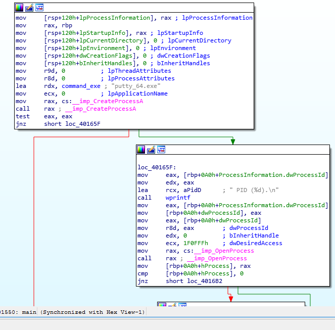

#### update: all code has finally been uploaded, as the project is complete.

# this project allows a gui framework in windows to inject shell / asm in both x64 and x32 architecture on windows platform

### The ui allows configuring as well as has a debug panel

## The project incorporates 2 techniques -

### 1. codecave

Below is the proof code cave allows to inject code without changing the file size at all

### 2. remote thread injection

Analysis of remote thread injection in IDA

POC for remote thread injection

## STEPS TO USE
1. copy clean apps to working directory
2. execute the exe file and enter file name
3. save file name and click on execute!!! for the appropriate architecture

notice:
i hold zero accountablity for usage of this or similar code, this has been posted only for educational purposes and should not be used for any other purpose.
